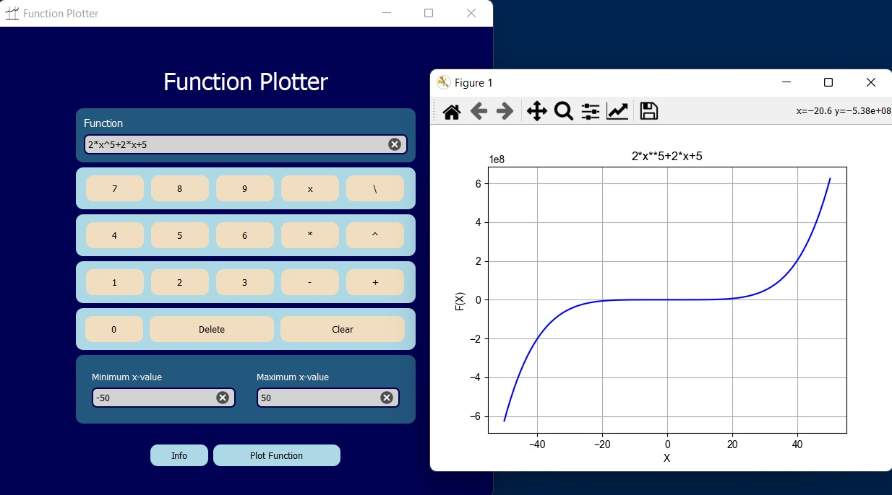
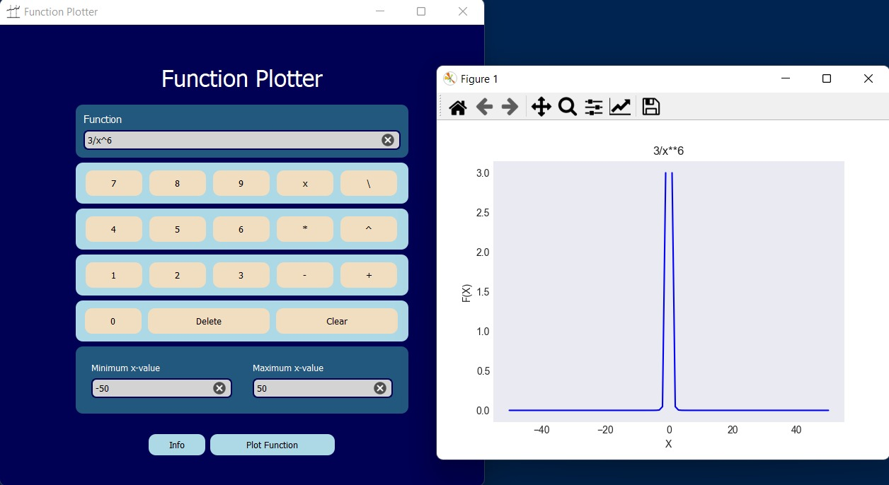
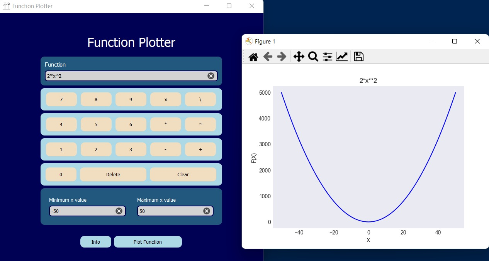
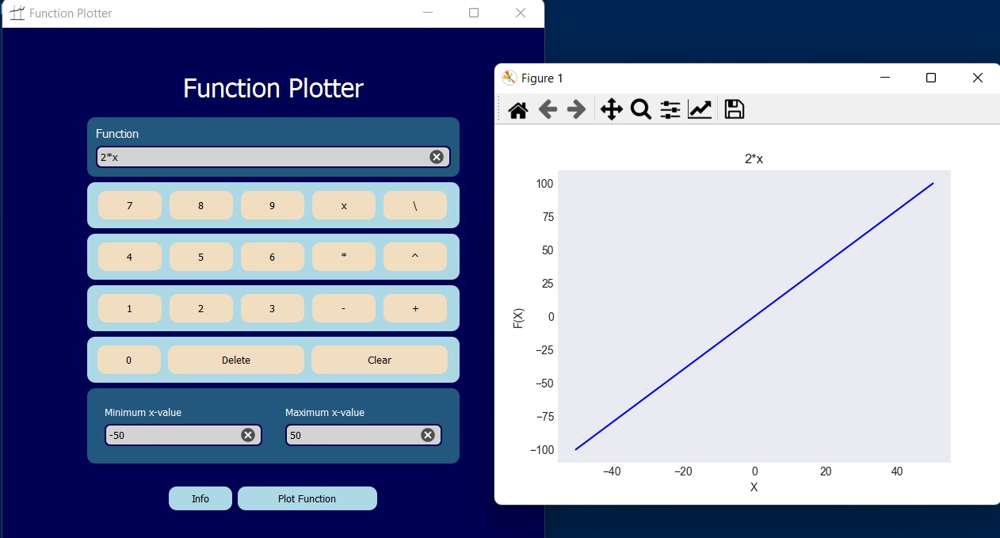
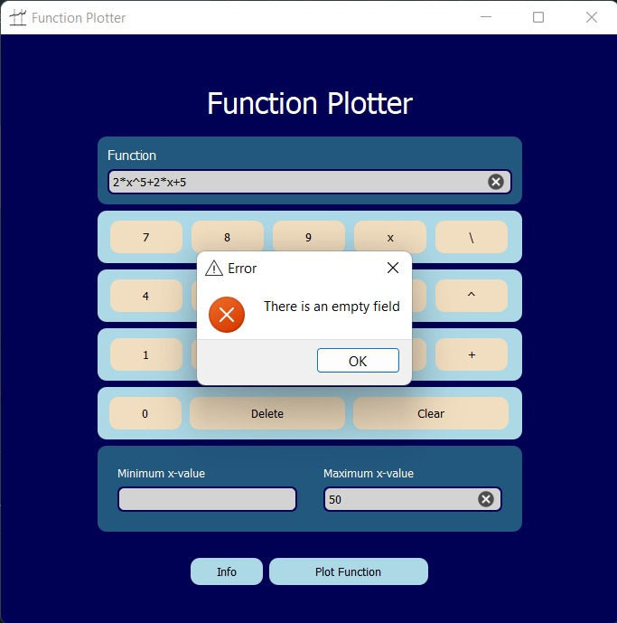

# Function Plotter

 

## 💻 Built With
 <ul>
  <li><a href="https://www.python.org/">Python</a></li>
  <li><a href="https://build-system.fman.io/pyqt5-tutorial">PyQt5</a></li>
  <li><a href="https://docs.python.org/3/library/unittest.html">Unittest</a></li>
    <li><a href="https://numpy.org/">NumPy</a></li>
  <li><a href="https://matplotlib.org/">Matplotlib</a></li>
 </ul>

## 📙 About

GUI program that plots arbitrary user-entered function in his chosen range of indicies

## 📝 Description
* Only the following operators are supported: + - / * ^.
* Take a function of x from the user, e.g.,2*x+3*x*4. 
* Take min and max values of x from the user. 

## 🏁 Getting Started
<blockquote>
  
This is a list of needed instructions to set up your project locally, to get a local copy up and running  please follow these instructuins.
 

</blockquote>
<h2 href="#structure">File Structure</h2>
 
 
  <pre>
Function-Plotter
├── screenshots
├── Images
├── Plotting.py
├── LICENSE
├── README.md
├── Interface.ui
├── ErrorHandler.py
├── main.py
├── Testing.py
  </pre>

<h3 href="#installation">Installation</h3>
<ol>
  <li><strong><em>Clone the repository</em></strong>
    <blockquote>$ git clone https://github.com/AbdelrahmanNoaman/Function_Plotter</blockquote>
  </li>
  <li> 
  <strong><em>Navigate to repository directory
</em></strong>
    <blockquote>$ cd Function-Plotter</blockquote>
  </li>
  <li> 
  <strong><em>Install dependencies
</em></strong>
    <blockquote>$ python -m pip install -U matplotlib</blockquote>
 <blockquote>$ pip install PyQt5</blockquote>
  </li>
</ol>
<h3 href="#Running">Running</h3>
<ol>
  <li><strong><em>Run Function Plotter </em></strong>
       <blockquote>$ python app.py </blockquote>
  </li>
</blockquote>
  </li>
 
</ol>

## Screenshots

### Main Screen

### Graphs

### Error messages
#### Invalid Expression

#### Empty Function

#### Min is greater than Max

#### Fields are empty

#### Min or Max aren't a number

## Contributors

<table>
<tr>
<td align="center">
<a href="https://github.com/AbdelrahmanNoaman" target="_blank">
 <b>Abdelrahman Noaman</b></a> 
</td>
</tr>
 </table>

## License

This project is licensed under the [MIT] License - see the [LICENSE.md](LICENSE) file for details